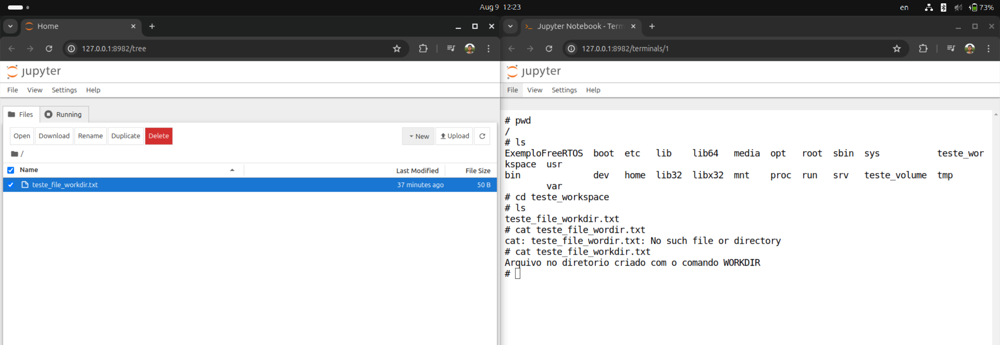
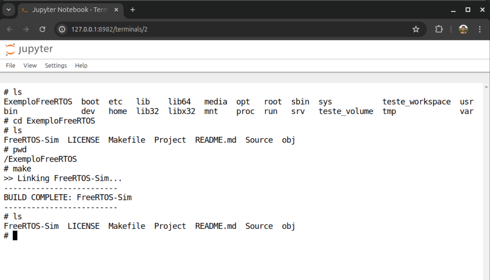

# PCS3746 - Sistemas Operacionais

# Relatório da Atividade 04

### Integrantes:

> Carlos Henrique Silva Thiersch - 11831679
> 
> Renato Naves Fleury - 11805269

## Criando uma imagem do docker

Após a instalação do docker, dentro do diretório da atividade 04, foi criado um arquivo com nome `Dockerfile` com os seguintes comandos:

```DOCKERFILE
 Imagem base para a criação da nova imagem
FROM ubuntu:20.04

# Declara um ponto de montagem dentro do container que será persistente e compartilhado com o host ou outros containers
VOLUME teste_volume

# Cria um diretorio de trabalho
WORKDIR /teste_workspace

# Instalação dos pacotes necessários na imagem
RUN apt-get update && apt-get install -y \
    build-essential \
    libc6-dev-i386 \
    wget \
    curl

RUN apt-get update
RUN apt-get install python3 -y
RUN apt-get install python3-pip -y
RUN pip3 install --upgrade pip
RUN pip3 install tensorflow
RUN pip3 install pandas scikit-learn matplotlib seaborn jupyter pyyaml h5py auto-sklearn


# Copia os arquivos para dentro da imagem
COPY ExemploFreeRTOS /ExemploFreeRTOS

# Especifica quais portas poderão ser liberadas ao criar o container
EXPOSE 8982
```

Logo em seguida, ainda dentro do mesmo diretório, executou-se o comando para gerar uma imagem a partir do `Dockerfile`:

```BASH
$ docker build -t teste_image -f Dockerfile .
```

> `-t` : permite especificar um nome para a imagem
>
> `-f` : nome do arquivo Dockerfile

## Instanciando um Container de uma imagem

O passo seguite é a própria criação e exexução do container:

```BASH
$ sudo docker run -it --name teste_container -p 8982:8982 --cpus="1" --memory="2g" teste_imagem bash
```

> `-i` : mantém o STDIN aberto, permitindo que o terminal do usuário continue enviando dados para o container.
>
> `-t` : aloca um terminal TTY pseudo, que é necessário para interações baseadas em terminal
>
> `--name` : especifica o nome do container
>
> `-p` : publica uma porta do container para o host
>
> `--cpus` : especifica a quantidade de cpus do host alocadas para o container
>
> `--memory` : especifica a memoria do host alocada para o container

## Persistência de Arquivos do Container

Após a inicialização do container, criou-se um arquivo .txt no diretório criado com o comando WORKDIR (/teste_workdir) e outro no diretório criado com o comando VOLUME (/teste_volume). Quando um arquivo é criado dentro de um container docker, esse arquivo pertence ao sistema de arquivos do container e portanto existe apenas durante o ciclo de vida do container, porém se o arquivo for criado dentro de um VOLUME esse arquivo persistirá mesmo após o ciclo de vida do container pois, nesse caso, o arquivo pertence ao sistema de arquivos do host.

## Jupyter Notebook no Container

Em seguida criou-se um servidor do jupyter notebook através do seguinte comando no terminal do container docker:

```BASH
jupyter notebook --ip 0.0.0.0 --port 8982 --no-browser --allow-root
```

> `--ip` : define o endereço IP no qual o Jupyter Notebook irá escutar.
>
> `--port` : especifica a porta na qual o Jupyter Notebook será executado.
>
> `--no-browser` : impede que o Jupyter Notebook tente abrir automaticamente o navegador da web.
>
> `--allow-root` : permite que o Jupyter Notebook seja executado como usuário root.

A imagem a seguir demonstra que o comando anterior foi bem sucedido.



## Exportando um Container

Para exportar o container docker foi executado o seguinte comando:

```BASH
docker export -o teste_container_exportado.tar teste_container
```

> `-o` : especifica o nome do arquivo de saída

## Exemplo FreeRTOS

Por fim, para executar o exemplo do FreeRTOS fornecido, foi copiado o arquivo fornecido para dentro do container por meio do comando `COPY` presente no dockerfile que faz uma cópia de uma arquivo do sistema de arquivos do host para para o sistema de arquivos do container. Logo em seguida, estando dentro do diretório /ExemplorFreeRTOS, foi executado o comando `make`.

A imagem a seguir demonstra que o procedimento foi bem sucedido.

